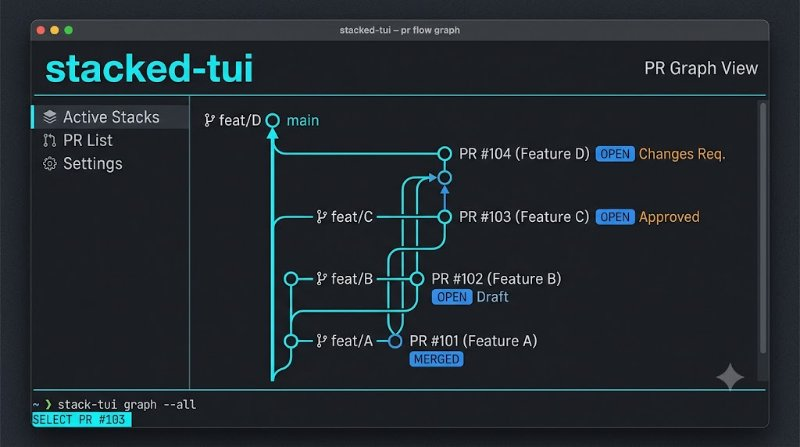

# stacked-tui

> **Beautiful TUI for gh-stack — visualize stacked PRs as interactive graph. Reads `git log --graph` and highlights stacked branches.**

<p align="center">
  
</p>

<p align="center">
  <em>Hero: stacked PRs as graph — TUI with branches — generated with Gemini</em>
</p>

  

```bash
npx stacked-tui show
npx stacked-tui show --json
npx stacked-tui show --only-stack
```

---

## Why?

Stacked PRs are powerful but invisible — `git log --graph` is noisy, `gh pr list` doesn't show stacking. This TUI parses the graph, highlights `HEAD` and `origin/` stacks, and shows only what matters for stacked workflows.

## Demo

```bash
stacked-tui show
# ⎈ Stacked PRs — 5 commits (3 stacked, 3 branches)
```

```
┌───┬──────────┬──────────────────────┬──────────────────────────────────┬───────┐
│ # │ Graph    │ Branch               │ Message                          │ Stack │
├───┼──────────┼──────────────────────┼──────────────────────────────────┼───────┤
│ 0 │ *        │ feature/auth         │ feat: top of stack (HEAD)        │ ✓     │
│ 1 │ *        │ origin/feature/base  │ feat: middle                     │ ✓     │
│ 2 │ *        │ main                 │ chore: base                      │ -     │
└───┴──────────┴──────────────────────┴──────────────────────────────────┴───────┘
```

```bash
stacked-tui show --only-stack --json | jq
```

## Installation

**One-liner (npx):**
```bash
npx stacked-tui show
# alias: npx stacked-tui graph
```

**Global:**
```bash
npm install -g stacked-tui
stacked-tui show --json
```

**From source:**
```bash
git clone https://github.com/trenysx/stacked-tui
cd stacked-tui
npm install
npm test
```

## Usage

```bash
# Show stacked PRs
stacked-tui show
stacked-tui show --json
stacked-tui show --only-stack
stacked-tui show --branch feature/auth
stacked-tui show --limit 30 --report report.md

# Raw graph
stacked-tui graph --limit 20

# Summary
stacked-tui summary --json

# Mock (no git required)
stacked-tui mock
stacked-tui mock --json
```

### CLI Options (shared)

| Command | Key Options |
|---------|-------------|
| `show` | `--json`, `--only-stack`, `--branch <name>`, `--limit <n>`, `--report <path>` |
| `graph` | `--limit <n>` |
| `summary` | `--json` |
| `mock` | `--json` |

## Features

- **Graph parsing:** `parseLogString()` extracts `graph`, `msg`, `branch`, `hash`, `depth`, `isMerge` from `git log --graph --decorate --oneline`
- **Stack detection:** `isStackCommit()` flags `HEAD`, `origin/`, `stacked`, `feature/` etc.
- **Branch extraction:** `extractBranch()` handles `HEAD -> feature/auth`, `origin/`, multi-branch parens
- **Filtering:** `filterStack({onlyStack, branch})` for focused views
- **Reports:** `generateStackReport()` markdown with summary table
- **Mock fallback:** `getMockStack()` when not a git repo or `git` missing
- **JSON for agents:** Every command `--json`

## Test

```bash
npm test
```

| Test | Status |
|------|--------|
| parseStack returns array | PASS |
| parseLogString graph/msg | PASS |
| parseLogString merges/depth | PASS |
| parseLogString empty | PASS |
| isStackCommit | PASS |
| extractBranch HEAD arrow | PASS |
| extractBranch multiple | PASS |
| extractHash | PASS |
| getMockStack | PASS |
| getStackSummary | PASS |
| filterStack | PASS |
| generateStackReport | PASS |
| parseStack with limit | PASS |
| parseStack mockOnFail | PASS |
| getMockStack structure | PASS |
| isStackCommit case insensitive | PASS |

**16 tests passing** — parsing, extraction, summary, filtering, reports.

## License

Apache-2.0 — see [LICENSE](./LICENSE). Third-party in [THIRD_PARTY.md](./THIRD_PARTY.md).

---

## Contributing

PRs welcome! See [CONTRIBUTING.md](./CONTRIBUTING.md).

1. Fork → `git checkout -b feat/foo` → commit → push → PR
2. Run `npm test` — 16 must pass
3. Test with `node src/cli.js show --json` in a stacked repo

## FAQ

**Does it need `gh`?** No, only `git`. Parses `git log --graph --all --decorate` directly.

**What if not a git repo?** Falls back to `getMockStack()` (3 commits) so `show` always works for demo.

**How does it detect stacked PRs?** Heuristic: `HEAD`, `origin/`, `feature/`, `stack` in message, or `->` in decorate. See `parser.js:22` `isStackCommit()`.

**Can I filter by branch?** Yes: `stacked-tui show --branch feature/auth --json`

**Does it need a TUI?** Current is table-based; full interactive TUI (ink) is on roadmap.

## Architecture

```
stacked-tui/
├── src/
│   ├── cli.js              # commander, 4 commands (show/graph/summary/mock/demo)
│   ├── parser.js           # parseStack, parseLogString, isStackCommit, extractBranch, getMockStack, filterStack, generateStackReport
│   └── OPEN_CORE_BOUNDARY.md
├── test/
│   └── parser.test.js      # 16 tests
├── assets/
│   └── hero.jpg            # Gemini hero (800x447)
├── LICENSE / THIRD_PARTY.md
└── package.json
```

**No build step** — pure ESM, `node src/cli.js`.

## Roadmap

- [ ] Interactive TUI with `ink` — keyboard nav, select PR, `gh pr view`
- [ ] `stacked-tui create <branch>` — create stacked branch with `git checkout -b`
- [ ] `stacked-tui sync` — rebase stack on main
- [ ] VS Code extension for stacked PR graph

## Examples

```bash
# Show only stacked
stacked-tui show --only-stack

# Filter by branch
stacked-tui show --branch auth --json

# Write report
stacked-tui show --report report.md && cat report.md
# # Stacked PRs Report — 2026-08-24
# - Total commits: 5
# | # | Graph | Branch | Message | Stack |
```

## Version

Current `v0.1.0` — see [package.json](./package.json).

---

**Star if this made your stacked PRs visible — and tell us your stack depth!**
